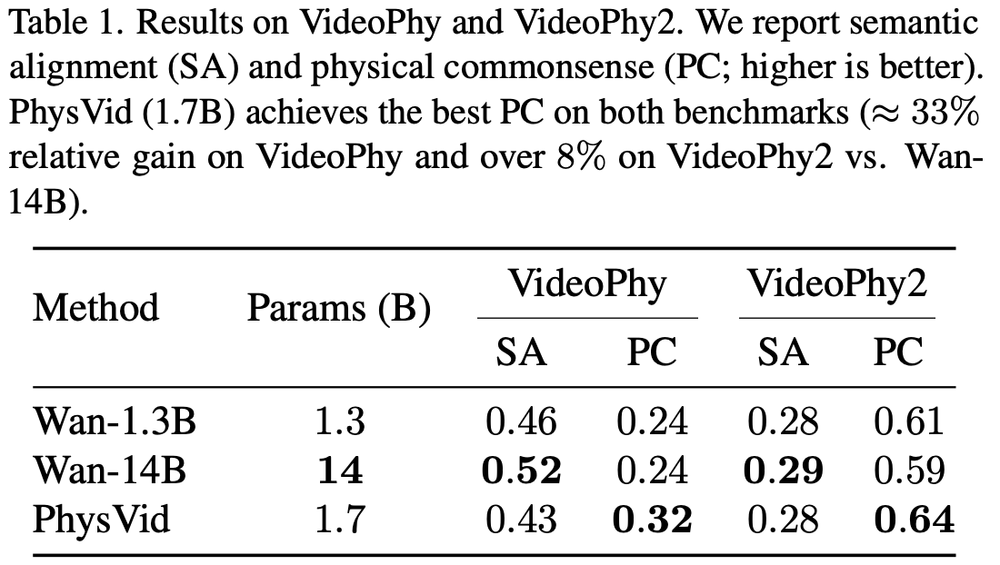
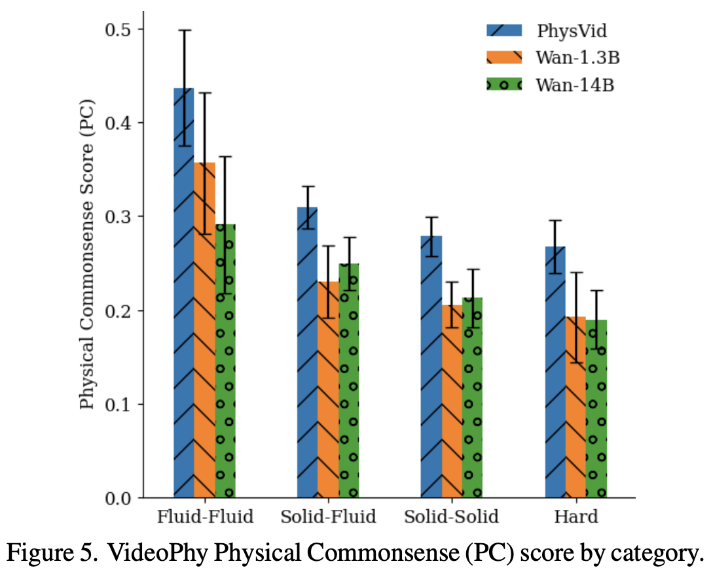

# PhysVid: Physics Aware Local Conditioning for Generative Video Models

<div style="text-align:flex; margin-top:8px; margin-bottom:8px;">
  <emph style="font-size:20px;">CVPR 2026</emph>
</div>

[](https://arxiv.org/abs/TBD)
[](https://5aurabhpathak.github.io/PhysVid)
[](https://huggingface.co/5aurabhpathak/physvid/tree/main)

<p class="authors">
        <a href="#" target="_blank" rel="noopener">Saurabh Pathak</a><sup>1</sup>
        <span class="sep">·</span>
        <a href="#" target="_blank" rel="noopener">Elahe Arani</a><sup>1,2</sup>
        <span class="sep">·</span>
        <a href="#" target="_blank" rel="noopener">Mykola Pechenizkiy</a><sup>1</sup>
        <span class="sep">·</span>
        <a href="#" target="_blank" rel="noopener">Bahram Zonooz</a><sup>1,2</sup>
</p>

<p class="affils">
    <span><sup>1</sup>Eindhoven University of Technology</span>
    <span class="sep">·</span>
    <span><sup>2</sup>Company</span>
</p>


## Abstract

Generative video models achieve high visual fidelity but often violate basic physical principles, limiting reliability in real‑world settings. Prior attempts to inject physics rely on conditioning: frame‑level signals are domain‑specific and short‑horizon, while global text prompts are coarse and noisy, missing fine‑grained dynamics. We present **PhysVid**, a physics‑aware local conditioning scheme that operates over temporally contiguous chunks of frames. Each chunk is annotated with physics‑grounded descriptions of states, interactions, and constraints, which are fused with the global prompt via chunk‑aware cross‑attention during training. At inference, we introduce negative physics prompts (descriptions of locally relevant law violations) to steer generation away from implausible trajectories. On VideoPhy, PhysVid improves physical commonsense scores by $\approx 33\%$ over baseline video generators, and by up to $\approx 8\%$ on VideoPhy2. These results show that local, physics‑aware guidance substantially increases physical plausibility in generative video and marks a step toward physics‑grounded video models.

<div style="border-top: 2px solid red; padding-top: 10px; margin-top: 10px; margin-bottom: 10px;">
  ⚠️ This repo is a work in progress. Expect frequent updates in the coming weeks.
</div>


## Environment Setup
[](https://pytorch.org)
[](https://www.python.org)

```bash
# conda create -n physvid python=3.12 -y
# conda activate physvid
python -m venv physvid
source venvs/physvid/bin/activate
pip install torch==2.7.1+cu128 --index-url https://download.pytorch.org/whl/cu128
pip install torchvision psutil
pip install flash-attn --no-build-isolation
pip install -r requirements.txt 
python -m setup install
```

Also download the Wan T2V base model from [here](https://github.com/Wan-Video/Wan2.1) and save it to weights/wan_models/Wan2.1-T2V-1.3B. If you intend to also evaluate Wan14B T2V, download it as well.

## Inference Example 

First download the checkpoint: [PhysVid Model](https://huggingface.co/5aurabhpathak/physvid/blob/main/physvid.pt)

### Single sample generation

```bash 
python tests/test_inference_single.py
```

### Full VideoPhy/VideoPhy2 evaluation
First, generate the samples for the VideoPhy/VideoPhy2 dataset. Please modify the generate_config.yaml file as needed. 

```bash
torchrun --nproc_per_node 8 physvid/evaluation/generate_videophy_samples.py --config_path configs/generate_videophy_samples.yaml
```

Once the samples are generated, you can evaluate their physical plausibility on the corresponding benchmark using the provided evaluation script. Please modify the eval_config.yaml file as needed.
Before running the command below, make sure to download the [VideoPhy](https://huggingface.co/videophysics/videocon_physics/tree/main) and [VideoPhy2](https://huggingface.co/videophysics/videophy_2_auto/tree/main) models using standard huggingface-cli and save them to `weights/videophy` and `weights/videophy2`, respectively.
```bash 
torchrun --nproc_per_node 8 physvid/evaluation/eval.py --config_path configs/eval_config.yaml
```

The results from our own evaluation in the paper are shown below.

<!-- Two slide-like cards side-by-side; each card frames one image and preserves its aspect ratio -->
<div style="display:flex; justify-content:center;">
  <div style="width:100%; max-width:1200px; display:flex; gap:16px; flex-wrap:wrap; justify-content:center;">
    <!-- Card 1 -->
    <div style="flex:1 1 48%; min-width:280px; background:#ffffff; border:1px solid #e6eef6; box-shadow:0 6px 18px rgba(15,23,42,0.08); border-radius:8px; padding:12px; height:280px; display:flex; align-items:center; justify-content:center; overflow:hidden;">
      
    </div>
    <!-- Card 2 -->
    <div style="flex:1 1 48%; min-width:280px; background:#ffffff; border:1px solid #e6eef6; box-shadow:0 6px 18px rgba(15,23,42,0.08); border-radius:8px; padding:12px; height:280px; display:flex; align-items:center; justify-content:center; overflow:hidden;">
      
    </div>
  </div>
</div>


## Training  

### Dataset Preparation 

We use the [WISA80k Dataset](https://huggingface.co/datasets/qihoo360/WISA-80K/tree/8fbd4a1d1a83bdd9e1f58187d1974c3fbb3a0d37) (80K videos) for training. 

First, download the [VideoLLama3-7B](https://huggingface.co/DAMO-NLP-SG/VideoLLaMA3-7B) from the huggingface repo. To prepare the dataset, follow these steps. Alternatively, you can skip the steps below and download the final LMDB dataset and local annotations from [here](https://huggingface.co/5aurabhpathak/physvid/tree/main).

```bash
# download and extract video from the WISA dataset 
python data_processing/download_extract_hf_dataset.py  --local_dir XXX --revision 8fbd4a1d1a83bdd9e1f58187d1974c3fbb3a0d37

# precompute the vae latent 
torchrun --nproc_per_node 8 data_processing/create_vae_latent_lmdb.py --config_path configs/create_vae_latent_lmdb.yaml

# run local annotation generation. This will generate the local annotations for each video chunk and save them in a json file.
torchrun --nproc_per_node 8 data_processing/filter_annotate_dataset.py --config_path configs/vlm_annotate_config.yaml
```

### Training

Please modify the wandb account information in `train.yaml`. Then launch the training using the command below.
```bash
torchrun --nnodes 8 --nproc_per_node=8 --rdzv_id=5235 \
    --rdzv_backend=c10d \
    --rdzv_endpoint $MASTER_ADDR physvid/train.py \
    --config_path  configs/wan_causal_dmd.yaml  --no_visualize
```

## Citation 

If you find PhysVid useful or relevant to your research, please cite our paper:

```bib
@inproceedings{pathak2026physvid,
  title     = {PhysVid: Physics Aware Local Conditioning for Generative Video Models},
  author    = {Pathak, Saurabh and Arani, Elahe and Pechenizkiy, Mykola and Zonooz, Bahram},
  booktitle = {Proceedings of the IEEE/CVF Conference on Computer Vision and Pattern Recognition (CVPR)},
  year      = {2026}
}
```

## Known Issues and Limitations
- The current implementation is optimized for the WISA80k dataset and may require adjustments to work with other datasets.
- The VLM is hardcoded to use the VideoLLama3-7B model. Adapting to other VLMs may require modifications to the codebase.
- The training process is computationally intensive and may require access to high-performance computing resources.
- The evaluation is currently limited to the VideoPhy and VideoPhy2 benchmarks. Evaluating on additional benchmarks may require further code modifications.

### Bugs
We will document the bugs in this section as we identify and fix them. Please feel free to report any issues you encounter while using the code. We will do our best to address them in a timely manner.

## Acknowledgments

This work is supported by the EU funded <em>SYNERGIES</em> project (Grant Agreement No. <em>101146542</em>). We also gratefully acknowledge the <em>TUE</em> supercomputing team for providing the <em>SPIKE-1</em> compute infrastructure to carry out the experiments reported in this paper.

A portion of the code related to data processing, training and flow matching is adapted from [CausVid](https://github.com/tianweiy/CausVid).

Wan Model related code is adapted from [Wan Video](https://github.com/Wan-Video/Wan2.1).

VideoPhy/VideoPhy2 code is adapted from [videophy](https://github.com/Hritikbansal/videophy).

We thank the respective authors for open-sourcing their code.

<!-- Partner / funding logos (TUESCC, Synergies, EU) -->
<div style="display:flex; justify-content:flex; gap:20px; align-items:center; margin-top:24px;">
  
  
  
</div>

